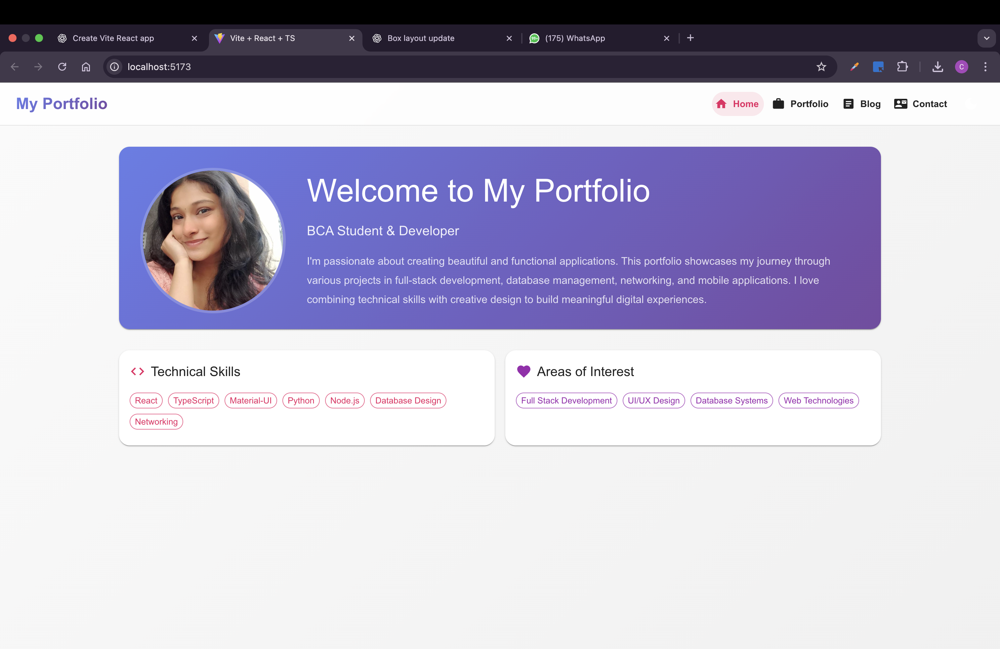

# Personal Portfolio Website



This is a personal portfolio website built with **React**, **TypeScript**, and **Vite**.  
It showcases projects, blogs, and contact information in a clean and responsive design.

## 🚀 Tech Stack

- **React + TypeScript**
- **Vite** for fast builds and dev server
- **Material-UI (MUI)** for UI components
- **Context API** for theme management

## 📂 Project Structure

```
.
├── App.css / App.tsx       # Main app entry
├── assets/                 # Images and static assets
├── Components/             # Reusable UI components (Home, Navbar, Portfolio, Blog, etc.)
├── Context/                # Theme context provider
├── Data/                   # Mock data for projects and blogs
├── theme.ts                # Custom MUI theme
├── Types/                  # TypeScript type definitions
├── index.css / main.tsx    # Entry point and global styles
└── vite-env.d.ts           # Vite environment types
```

## 🔧 Setup & Run

1. Install dependencies:
   ```bash
   yarn install
   ```
2. Start the development server:
   ```bash
   yarn dev
   ```
3. Open [http://localhost:3000](http://localhost:3000) in your browser.

## 📌 Features

- Responsive portfolio sections (Home, Projects, Blog, Contact)
- Theming with Context API
- Clean UI with MUI
- Mock data integration for easy customization

## 📄 License

This project is open-source and free to use.
